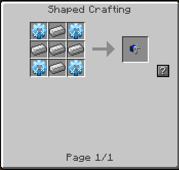
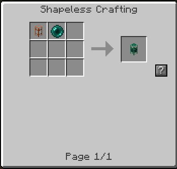
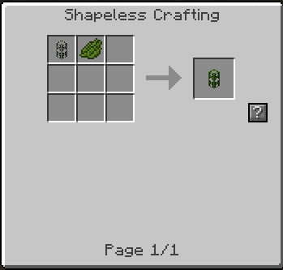
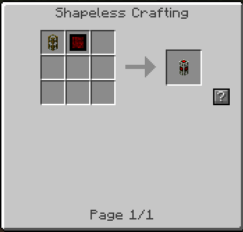
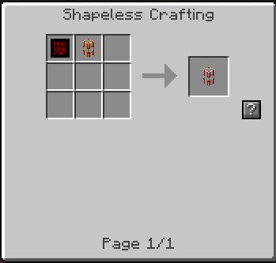

# Additional Buildcraft Objects

   

   Minecraft Forum: http://www.minecraftforum.net/forums/mapping-and-modding/minecraft-mods/2310397-additional-buildcraft-objects-a-plugin-for

   Download Links:   https://github.com/da3dsoul/Additional-Buildcraft-Objects/releases

   Please report any bugs to GitHUB: https://github.com/da3dsoul/Additional-Buildcraft-Objects

For recipes: I made some pictures, but it's best to use NEI.

## License

This is originally by Flow86, but I have at this point rewritten the entire mod.

My license is: unless you are Flow86, don't say it is yours. Other than that, I don't care. If I see it, I'd like to at least see a shoutout in at least 4pt font. If you download it, make sure you trust the source.
If you post an error, the first response if given at all will be to first re-download from me.

## Items

#### Windmills

* Recipe: 

      
      
      
* Placement rules:
Must be placed on 2 fence posts (or nether fence).
Must not have any opaque blocks within 2 blocks at its height or 1 below.
Can NOT push energy to the east (over the blades, they don't rotate).

Windmill energy rules are grouped into two sections: Plains and Hills.

Windmills gain two types of boosts: Biome and Height.

**Plains Rules:**
If a windmill is placed in a biome with low height variation (flat), it
will follow the Plains rule set.

* Biome:
Windmills gain a bonus for simply being placed in the plains section,
the amount of bonus depends on the biome. Flatter is better.

* Height:
Windmills placed as close as possible to sea level will provide the
maximum height boost. Sea level assumed 64 -> + 2 for fence posts -> the
windmill block should be at 66.

**Hills Rules:**

* Biome:
Windmills gain no bonus from biome placement in hills, but can make up
for it and still achieve maximum output with Height.

* Height:
The higher a windmill is placed in hills, the greater the bonus, capping
at a height of 124 meters.

All windmills gain an extra a boost in the rain.

The maximum output for windmills is 13.75 RF/t without rain and 15 RF/t
with rain.

### Ender Storage
Simply an Ender Chest for Buildcraft. Adding an insertion pipe to an
ender chest allows putting items in. Right-clicking on the insertion
pipe when connected opens the bc Ender Chest for easy of use and
debugging purposes, for that "where'd all my items go?" moment.

* Insertion:
The Insertion Pipe will choose to add items to the ender
chest before anything else. If you don't like that, don't put an ender
chest next to an insertion pipe. It is the only pipe that will connect
to them now.

* Ender Extraction Pipe
   * Recipe:

      
      *The Pipe is an Extraction Pipe
* Usage:
Stole/borrowed the gui from the emerald pipe in buildcraft, along with
all the logic and everything but the item extraction, which only pulls
from the ender storage. I doubt BC will sue me, and they can have it. I
just wanted a way to transport items 6000 blocks without making all that
pipe and then keeping it loaded. Yes, this works across dimensions.

Power it with an engine, it'll extract just like an emerald but connects to an ender chest.

## Pipes

#### Division Pipe
   Splits stacks into a specified size 1-8, incremented with a wrench. If 
   the stack has a remainder, the moving item will be reversed.

#### Round Robin Transport Pipe
   will change output per item(stack)

   * Recipe:

      

#### Insertion Transport Pipe
   Insertion Pipes given the choice between putting a item in the pipe in to an
   inventory (A chest or a furnace) and passing it along to another pipe, the
   Insertion Pipe will always try to add the item to the inventory.

   This pipe is very useful for feedback loops as it forces the item to go in
   to the last machine if it can.

   * Recipe:

      

#### Fluid Insertion Pipe
   Same as insertion pipe but for fluids. With the way the fluid system is set up in Buildcraft, the fluids will distribute equally to all attached tank blocks.

   * Recipe:

      

#### Extraction Transport Pipe
   Extraction Pipe is the opposite of the Insertion Pipe. If the pipe can choose
   between an inventory and another pipe the pipe will always go with the next
   pipe. Also this pipe behaves the same as a wood pipe where it will pull items
   out of an inventory if the pipe has an active redstone engine applied to it.

   This pipe is useful for tight spaces where you do not want a pipe to
   accidentally fill a chest or machine.

   * Recipe:

      

#### Crossover Transport Pipe
   This pipe will direct material entering it to the pipe
   (or something accepting material, like chests) directly across from it.
   If no such pipe exists, a random direction is chosen.

   * Recipe:

      

#### Compactor Transport Pipe
   Combines items(tacks) to larger itemstacks (currently to itemstacks >= 16 items)
    
   can be toggled/switched by ABO-Actions and Redstone

   * Recipe:

      

#### Valve Pipe
   acts like a (golden) wooden pipe (without need of wooden engine)
    
   can be toggled/switched by ABO-Actions and Redstone
   
   **can empty a full tank with enough (=full) pressure for two golden pipes in seconds!**
   
   Pressure behavior: Will empty down to half of tank valve pipe is connected to or entire tank if placed on bottom tank.
   
   Config option to disable pressure behavior.

   * Recipe:

      

#### Golden Iron Fluid Pipe
   acts like a iron pipe with speed of a golden pipe

   * Recipe:

      

#### Balancing Fluid Pipe
   balances liquid of connected tanks

   Thanks to Oxygene13 for his idea.

   * Recipe:

      

#### Kinesis Switch Pipe
   acts as lever for power pipes
    
   can be toggled/switched by ABO-Actions and Redstone

   * Recipe:

      

#### Diode Kinesis Pipe
   acts as a diode/iron pipe for kinesis pipes

   * Recipe:

      

#### Distribution Kinesis Pipe
   acts as a power distributor - every filter line which has an item in it is 
   "open" to receive power

   * Recipe:

      

## Actions

#### Switch On Pipe
   activates the pipe as long as the action is active
   (On/Off via Signal)
    
   a pipe toggled "on" will be set to off if switch-on is deactivated 
   
#### Toggle On Pipe
   activates the pipe and keeps it activated until a ToggleOff/SwitchOn occurs
   (On via Signal)
   
#### Toggle Off Pipe
   deactivates the pipe
   (Off via Signal)

---------------------------------------------------------------------------------

## Changelog:

**DA3DSOUL:**

MC 1.7.2+
  - rewrote everything...
  - Added windmills
  - Added Golden Iron Transport Pipe
  - Added Reinforced Golden and Golden Iron Fluid Pipes
  - Added Ender Extraction Pipe
  - Made Insertion Pipe insert into ender chests for a global level ender chest
  - Added Division Pipe
  - Added Mob Bottles and Yellow Dye on a Stick...which don't exist (from a different mod [DA3DSOUL Server] stuck in 1.8.1 beta I have been trying to update forever).
  
**Flow86:**

* 1.0.7@559
  - fixed recipe conflict (Iron Kinesis Pipe)
    renamed it to Directed Kinesis Pipe
  - renamed all Conductive Pipes to Kinesis Pipes in readme

* 1.0.6
  - fixed recipe conflict (Insertion Pipe)
    new recipe for Insertion Pipe: Cactus Green + Iron Transport Pipe

* 1.0.5
  - renamed Diamond Conductive Pipe to Distribution Conductive Pipe due to the fact
    that BC added "Diamond Conductive Pipe"
  - buildcraft compatibility

* 1.0.4
  - readded compactor pipe and made it special item aware 
    (simply saving/comparing the complete ItemStack)

* 1.0.3
   - added custom gui for diamond waterproof pipe
   - added custom gui for diamond conductive pipe
   - added water pump pipe like the one from AdditionalPipes
   - renamed "Power" Pipes to "Conductive", unless Power Switch Pipe

* 1.0.2
   - ported to 1.5.1
   - added additional actions
   - added correct textures for actions
   - valve pipe and powerswitch pipe react on those actions.

* 1.0.1@99
   - added gate settings duplicator

* 1.0.1
   - added diamond power pipe
   - fixed iron power pipe logic,
     failed to switch "output" to other power distributors like RedStoneCell

* 1.0.0
   - added iron power pipe

* 0.9.9@83
   - fixed diamond liqudis pipe loosing its filter on load/unload
   

* 0.9.9@81
   - fixed valve to stop output immediately

* 0.9.9
   - updated/readded diamond liquids pipe

* 0.9.8:
   - bc 3.4.2 compatible

* 0.9.7:
   - bc 3.4.0 / mc 1.4.7 compatible

* 0.9.6:
   - fixed various bugs (balance pipe and redstone engine ...)
   - updated/readded valve pipe

* 0.9.5:
   - bc 3.3.0 / mc 1.4.6 compatible
   

* 0.9.4:
   - updated/readded balance pipe

* 0.9.4@56:
   - updated/readded power switch pipe
   - updated/readded switch on pipe action
   - fixed bounce pipe

* 0.9.3:
   - mc 1.4.2 compatible

* 0.9.2:
   - bc 3.2.0pre compatible

* 0.9.1:
   - mc 1.3.2 compatible
   - bc 3.1.8 compatible
   - not everything is implemented again for 1.3.2

* 0.9:
   - removed engine control pipe (unnecessary now, buildcraft has a trigger api now)
   - mc 1.1 compatible
   - bc 3.1.2/2.2.12 compatible

* 0.8.2:
   - added diamond liquid pipe

* 0.8.1:
   - added engine control pipe

* 0.8:
   - added pipes from old "ExtraBuildcraftPipes"-Mod by leftler/blakmajik
       \- Insertion Transport Pipe
       \- Extraction Transport Pipe
       \- Bounce Transport Pipe
       \- Crossover Transport Pipe

      see: http://www.minecraftforum.net/topic/474348-173-2012-extrabuildcraftpipes/

      oh and YES - they gave me the permission (before someones shouting about copyright...)

* 0.7:
   - bc 3.0.4 compat
   - removed obsolete Redstone Power Converter
   - removed "Invalid Pipe" (buildcraft now reacts correctly on unknown pipe ids)

* 0.6f:
   - fix missing class file (damn packaging script ...)

* 0.6e:
   - fix valve crash 2 (sorry again!!)

* 0.6d:
   - fix valve crash (sorry!!)

* 0.6c:
   - bc 3.0.3 compat
   - mc 1.0.0 compat

* 0.6b:
   - bc 3.0.2 compat
   - fixed power switch pipe

* 0.6:
   - bc 3.0.1 compat
   - removed flowmeter (obsolete)

* 0.5b:
   - fixed bc > 2.2.2 compat

* 0.5:
   - added Redstone Power Converter
   - added Compactor Pipe

* 0.4:
   - added Balance Pipe

* 0.3:
   - added Flow Meter Liquids Pipe
   - changed recipes

* 0.2:
   - fixed Valve Liquids Pipe
   - added Power Switch Pipe
   - added Golden Iron   Liquids Pipe

* 0.1:
   - added Round Robin Transport Pipe
   - added Valve Liquids Pipe

---------------------------------------------------------------------------------

Recipe Images generated by [Advanced Recipe Generator](https://github.com/Flow86/Advanced-Recipe-Generator-Mod)
